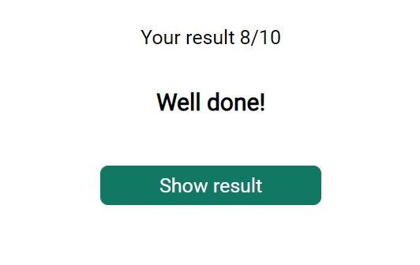
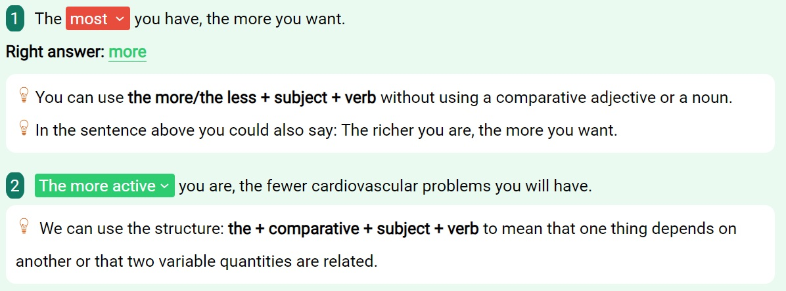

# English Test README

## Overview

This repository contains the source code for an English "The … the …
comparatives" test web application. The test assesses knowledge of comparative
forms in English sentences. Users are presented with sentences containing blanks
to fill with the correct comparative forms. The correct answer can be chosen
from a dropdown input. To check the results, all fields must be filled. After
clicking the "Check Results" button, a modal window appears with the test
outcome and a "Show Result" button. Closing the modal allows users to review
correct answers and receive a brief explanation of the grammar rule. After
completing the test, users can use the "Try Again" button for a new attempt. The
project uses HTML, Less, and JavaScript.

## Technologies Used

- **HTML:** The structure and layout of the web application are defined using
  HTML.
- **Less:** Styles are written in Less, providing a more organized and
  maintainable stylesheet.
- **JavaScript:** Dynamic features and interactions are implemented using
  JavaScript.

## Features

- **Comparative Test:** Users fill in blanks in sentences with the correct
  comparative forms.
- **Dropdown Input:** Users choose the correct answer from a dropdown input.
  
- **Results Modal:** After checking results, a modal window appears with the
  test outcome. 
- **Show Result:** Users can reveal correct answers and receive brief
  explanations. 
- **Try Again:** A button allows users to reset the test for another attempt.

# Parcel template

This project was created using Parcel. For introduction and setup additional
features [refer to documentation](https://parceljs.org/).

## Preparing a new project

1. Make sure that the LTS version of Node.js is installed on your computer.
   [Download and install](https://nodejs.org/en/) it if necessary.
2. Clone this repository.
3. Change the folder name from `parcel-project-template` to your project name.
4. Create a new empty repository on GitHub.
5. Open the project in VSCode, launch a terminal and link the project to the
   GitHub repository
   [according to instructions](https://docs.github.com/en/get-started/getting-started-with-git/managing-remote-repositories#changing-a-remote-repositorys-url).
6. Install the project dependencies in the terminal with the command
   `npm install` .
7. Start development mode by running the command `npm start`.
8. Go to the address in your browser
   [http://localhost:1234](http://localhost:1234). This page will automatically
   reload after saving changes to the project files.

## Files and folders

- All parsals of style files should be located in the `src/sass` folder and
  imported into page style files. For example, for `index.html` the style file
  is called `index.scss`.
- Add images to the `src/images` folder. The builder optimizes them, but only
  when deploying the production version of the project. All this happens in the
  cloud, so there is no load your computer, as on weak machines this can take a
  long time.

## Deploy

To set up a project deployment, you need to perform several additional steps on
setting up your repository. Go to the `Settings` tab and subsections `Actions`
select select `General`.


Scroll to the last section where you make sure the options like on the next
image and click `Save`. Without these settings, the assembly will have
insufficient rights to automate the deployment process.


The production version of the project will be automatically built and deployed
to GitHub Pages, to the `gh-pages` branch, every time the `main` branch is
updated. For example, after a direct push or an accepted pull request. To do
this you need in the file `package.json` edit the `homepage` field and the
`build` script, replacing `your_username` and `your_repo_name` to your own, and
push the changes to GitHub.

```json
"homepage": "https://your_username.github.io/your_repo_name/",
"scripts": {
  "build": "parcel build src/*.html --public-url /your_repo_name/"
},
```

Next, you need to go to the GitHub repository settings (`Settings` > `Pages`)
and set the distribution of the production version of files from the `/root`
folder of the `gh-pages` branch, if this was not done automatically.


### Deployment status

The deployment status of the latest commit is displayed by an icon next to its
identifier.

- **Yellow color** - the project is being assembled and deployed.
- **Green** - deployment completed successfully.
- **Red** - an error occurred during linting, build or deployment.

More detailed information about the status can be viewed by clicking on the
icon, and in in the drop-down window, follow the `Details` link.


### Live page

After some time, usually a couple of minutes, the live page can be viewed to the
address specified in the edited `homepage` property. For example, here link to
live version for this repository
[https://goitacademy.github.io/parcel-project-template](https://goitacademy.github.io/parcel-project-template).

If a blank page opens, make sure there are no errors in the `Console` tab
associated with incorrect paths to CSS and JS project files (**404**). Quicker
all you have is an incorrect value for the `homepage` property or the `build`
script in file `package.json`.

## How it works


1. After each push to the `main` branch of the GitHub repository, a special
   script (GitHub Action) from file `.github/workflows/deploy.yml`.
2. All repository files are copied to the server, where the project is
   initialized and undergoes assembly before deployment.
3. If all steps were successful, the assembled production version of the project
   files goes to the `gh-pages` branch. Otherwise, in the execution log The
   script will indicate what the problem is.
